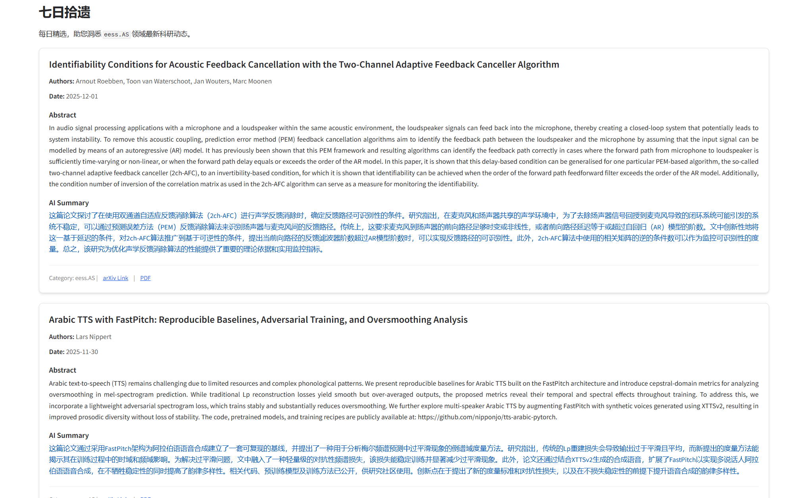

## `eess.AS` 七日拾遗

### 简介

- 自动爬取 arxiv eess.AS 类别下，向前推7个更新日的信息并进行汇总，提供对应的 arxiv 和 pdf 链接，并调用免费的 glm-4 进行中文总结，让你跟进学术前沿。

- 界面大致如下：

  

### 本地部署

1. git clone 本地克隆

   ```
   git clone https://github.com/lotuscarvedlife/7days_pickup.git
   ```

2. 装上必要的 requirements：

   ```
   pip install -r requirements.txt
   ```

3. 填写你的智谱清言 API key（[智谱AI开放平台用户 API Key](https://www.bigmodel.cn/usercenter/proj-mgmt/apikeys)）至 `summarize_by_zai.py` 中

4. 在 `app.py` 中选择部署方式：

   ```python
   # 本地纯享
   # app.launch()
   # 子网共享
   app.launch(server_name='0.0.0.0')
   ```

5. 运行！

   ```
   python app.py
   ```

### 待完成

- 本项目后端脚本非常邋遢和冗余，不过它是支持日期选择和类别选择的，在开发过程中为了偷懒就没做这类功能，待其他大佬做后续优化orz


### 参考/鸣谢

- [LI-MAX72/Awsome-Arxiv-Daily-Push: 拉取arixv每日文章，可以选定日期和关键词](https://github.com/LI-MAX72/Awsome-Arxiv-Daily-Push)
- [[arXiv] Audio and Speech Processing](https://arxiv.org/list/eess.AS/recent)
- [智谱AI开放平台](https://www.bigmodel.cn/)

